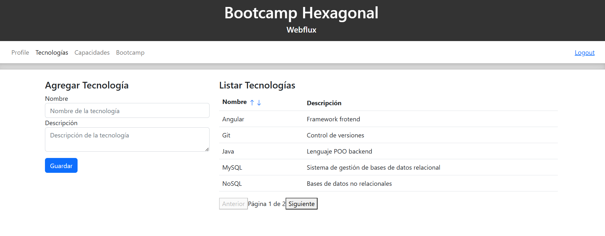
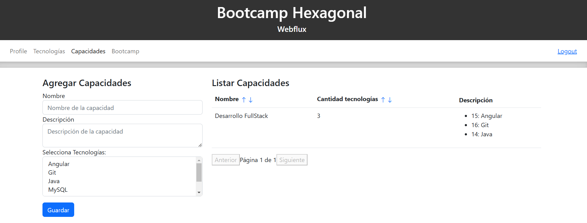
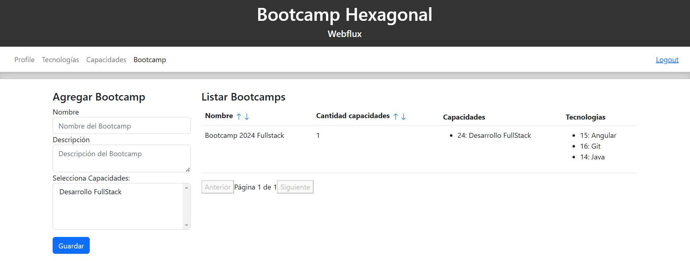
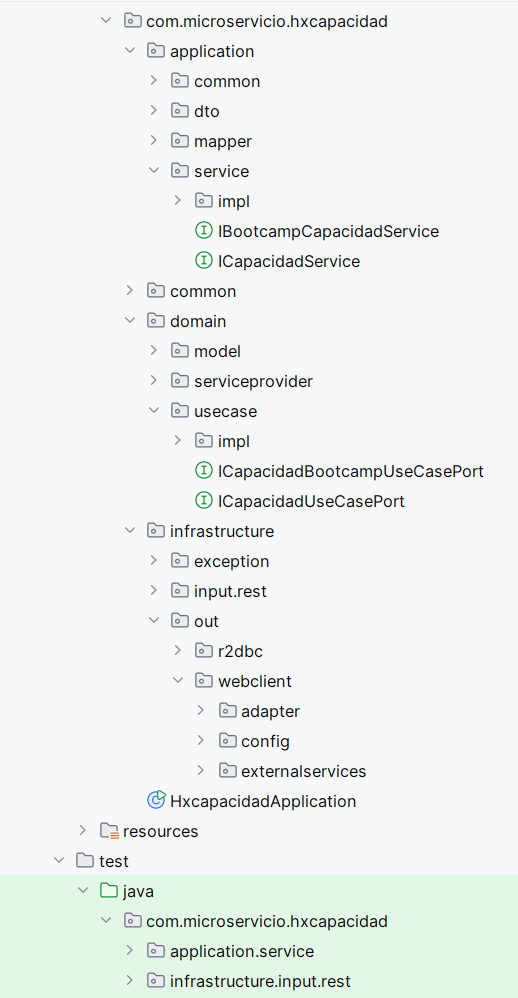
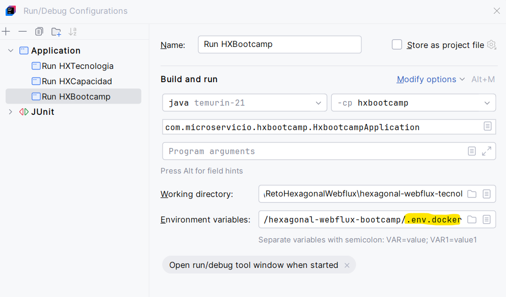

# Spring Webflux - Arquitectura Hexagonal - Aplicación web

> Proyecto para la creación de tecnologías, capacidades y bootcamps

### El proyecto incluye:

- 3 microservicios
- Aplicación de arquitectura Hexagonal
- Spring Webflux
- Interconexión entre microservicios
- Test unitarios automatizados
- Aplicación Web con Angular

## Instrucciones

1. **Crear las bases de datos locales con docker**
   ```
    docker run --name mysql-db-tecnologia -e MYSQL_ROOT_PASSWORD=passroot  -e MYSQL_DATABASE=tecnologias  -e MYSQL_PASSWORD=passroot  -p 3306:3306 -d mysql:latest
    ```
    ```
    docker run --name mysql-db-capacidad -e MYSQL_ROOT_PASSWORD=passroot  -e MYSQL_DATABASE=capacidad  -e MYSQL_PASSWORD=passroot -p 3307:3306  -d mysql:latest
    ```
    ```
    docker run --name mysql-db-bootcamp -e MYSQL_ROOT_PASSWORD=passroot  -e MYSQL_DATABASE=bootcamp  -e MYSQL_PASSWORD=passroot -p 3308:3306  -d mysql:latest
    ```
2. **Conectar con dbeaver**  
   MySQL: 
   ```
   URL: jdbc:mysql://localhost:3306/
   User: root
   Pass: [El indicado en docker]
   ```
   Si genera error "Public Key Retrieval is not allowed", entonces en Driver Settings colocar o agregar allowPublicKeyRetrieval en true

3. **Scripts base de datos**  
   ```
   CREATE DATABASE IF NOT EXISTS tecnologias;

   CREATE TABLE tecnologias (
    id INT AUTO_INCREMENT PRIMARY KEY,
    nombre VARCHAR(50) NOT NULL UNIQUE,
    descripcion VARCHAR(90) NOT NULL
   );
   ```

   ```
   CREATE DATABASE IF NOT EXISTS capacidad;

   -- Crear la tabla capacidades
   CREATE TABLE capacidades (
      id INT AUTO_INCREMENT PRIMARY KEY,
      nombre VARCHAR(50) NOT NULL,
      descripcion VARCHAR(90),
      cantidad_tecnologia INT NOT NULL
   );
   
   -- Crear la tabla de relación capacidad_tecnologia
   CREATE TABLE capacidad_tecnologia (
      id INT AUTO_INCREMENT PRIMARY KEY,
      id_capacidad INT NOT NULL,
      id_tecnologia INT NOT NULL
   );
   ```

   ```
   CREATE DATABASE IF NOT EXISTS bootcamps;

   -- Crear la tabla bootcamps
   CREATE TABLE bootcamp (
      id INT AUTO_INCREMENT PRIMARY KEY,
      nombre VARCHAR(50) NOT NULL,
      descripcion VARCHAR(90),
      cantidad_capacidad INT NOT NULL
   );

   -- Crear la tabla de relación capacidad_bootcamp
   CREATE TABLE capacidad_bootcamp (
      id INT AUTO_INCREMENT PRIMARY KEY,
      id_capacidad INT NOT NULL,
      id_bootcamp INT NOT NULL
   );
   ```

4. **Microservicio de tecnología**  
   [Ir al repositorio](https://github.com/PedroOsorioCode/hexagonal-webflux-tecnologia)

5. **Microservicio de capacidades**  
   [Ir al repositorio](https://github.com/PedroOsorioCode/hexagonal-webflux-capacidad)

6. **Microservicio de bootcamps**  
   [Ir al repositorio](https://github.com/PedroOsorioCode/hexagonal-webflux-bootcamp)  

7. **Aplicación Angular para consumo de microservicios**  
   [Ir al repositorio](https://github.com/PedroOsorioCode/hexagonal-webflux-angular-frontend)

8. **Swagger**  
[Tecnología](http://localhost:8080/swagger-ui/webjars/swagger-ui/index.html#/)  
[Capacidades](http://localhost:8081/swagger-ui/webjars/swagger-ui/index.html#/)  
[Bootcamp](http://localhost:8082/swagger-ui/webjars/swagger-ui/index.html#/)

9. **Resultado**
 - 
 - 
 -   

**Arquetipo Arquitectura Hexagonal**

 - 

**Configuración Run Proyectos**

 - 

### Recursos adicionales
- [Guía configurar Swagger Webflux](https://medium.com/@kamomillte/tutorial-adding-swagger-ui-to-a-spring-webflux-application-3ff7aebb63b8)
- [Teoría Spring Webflux](https://www.youtube.com/watch?v=NMDL8fkZT0U)
- [Metodos Spring Webflux](https://www.youtube.com/playlist?list=PLvimn1Ins-41pwh18gh_ZkxPOkrEEhXz6)
- [Colección Postman](Reto%20Hexagonal%20-%20Webflux%20-%20Mysql.postman_collection.json)
---

**Author**: Pedro Luis Osorio Pavas [Linkedin](www.linkedin.com/in/pedro-luis-osorio-pavas-68b3a7106)  
**Start Date**: 01-11-2024

