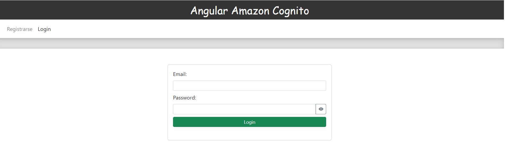
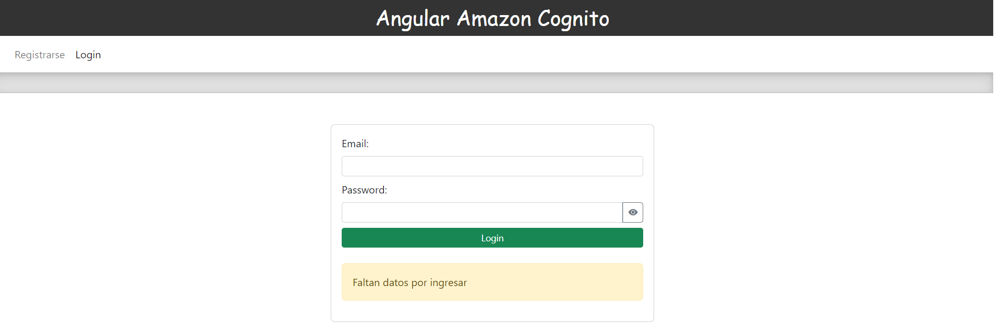
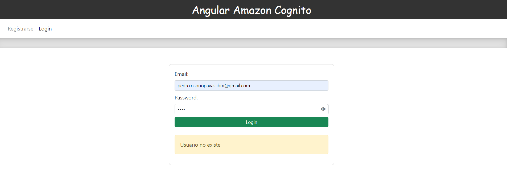
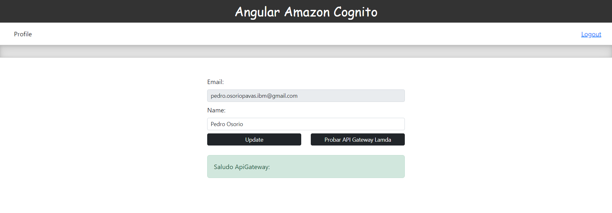
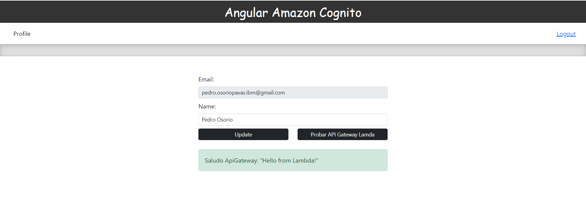
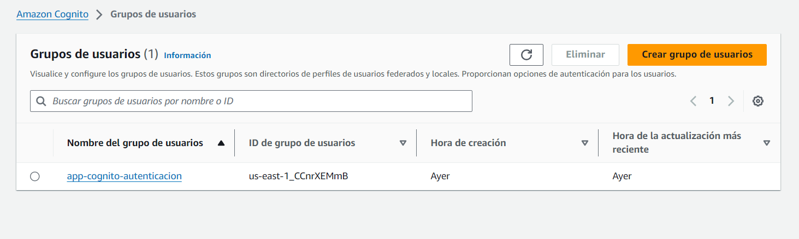
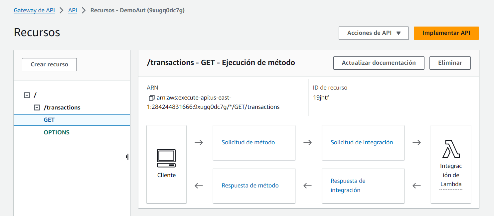
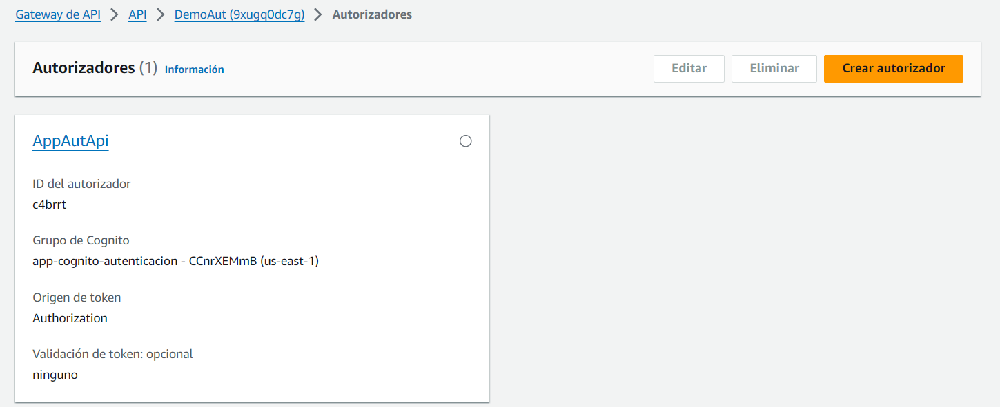
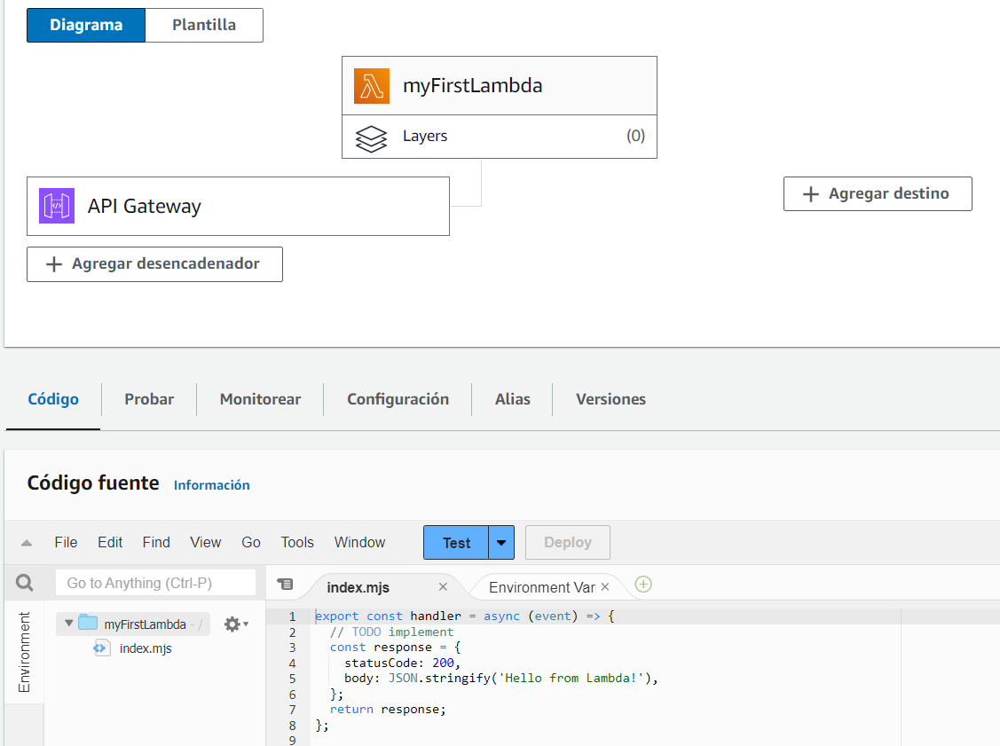

# Frontend Angular conexión Cognito AWS

> Proyecto en Angular que implementa diversas funcionalidades clave utilizando AWS Cognito para la autenticación y autorización de usuarios. 

### El proyecto incluye:

- Registro de usuarios: Permite a los usuarios crear una cuenta utilizando un formulario personalizado que interactúa con Cognito.
- Inicio de sesión y cierre de sesión: sistema de autenticación que utiliza los formularios de login para iniciar sesión y manejar la sesión del usuario de manera segura.
- Actualización del perfil de usuario: Los usuarios pueden actualizar sus datos personales desde un formulario que está conectado a su perfil de Cognito.
- Consumo de una API Gateway y Lambda: El proyecto está integrado con AWS API Gateway, que actúa como intermediario para ejecutar una función Lambda. Esta Lambda realiza operaciones en backend y su respuesta se visualiza directamente en la aplicación.

## Características

1. **Login**
   - 
   - 
   - 

2. **Profile**
   - 

3. **Api Gateway aplicación**
   - 

4. **Cognito**
   - 

5. **Api Gateway AWS**
   - 
   - 

6. **Lambda**
  - 

### Recursos adicionales
- [API Gateway, Lambdas, AWS Cognito](https://www.youtube.com/watch?v=oFSU6rhFETk&t=1s)
- [Crear y Configurar AWS Cognito](https://www.youtube.com/watch?v=-sS1A3fetMA)
---

**Author**: Pedro Luis Osorio Pavas [Linkedin](www.linkedin.com/in/pedro-luis-osorio-pavas-68b3a7106)
**Start Date**: 07-10-2024