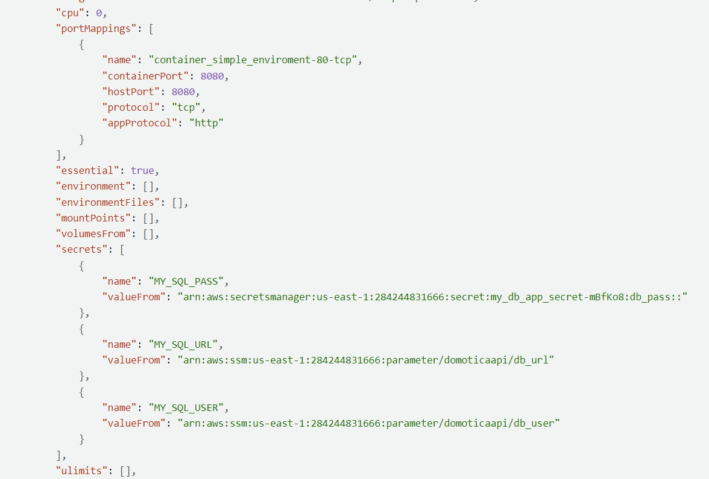
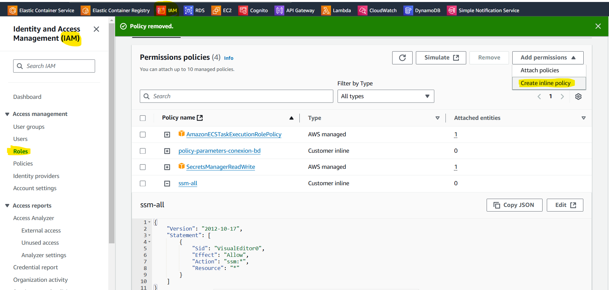
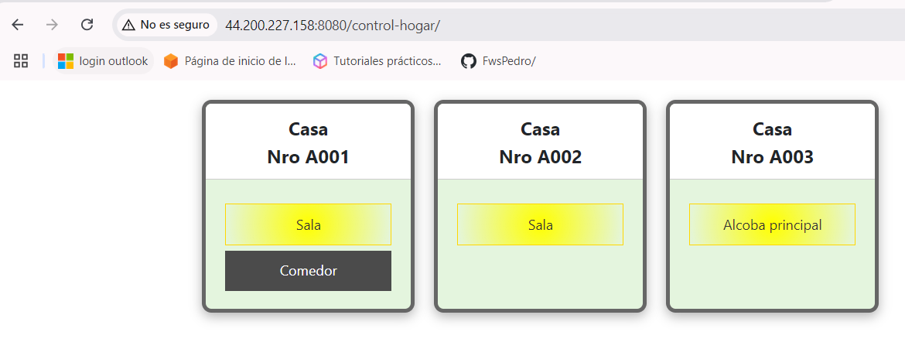
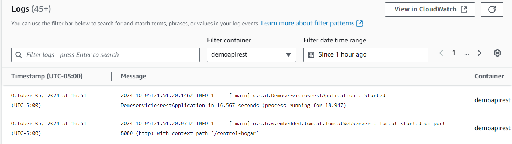
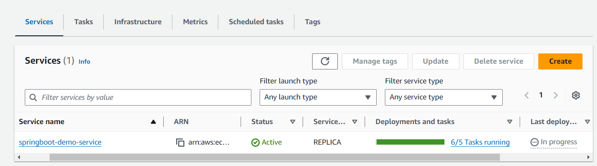
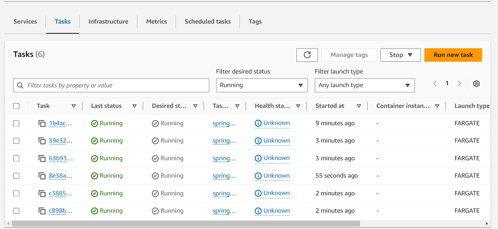
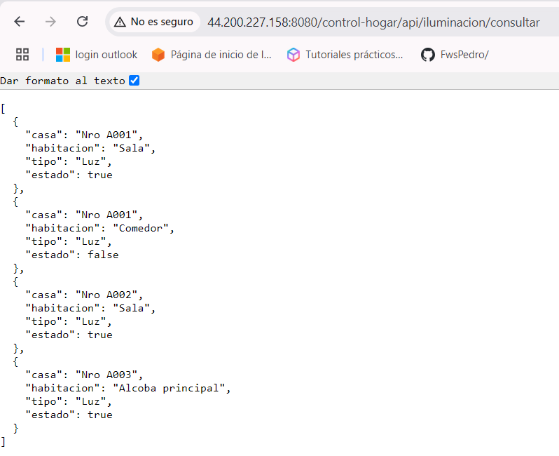

# Guía desplegar docker local y aws

> Describe los pasos a realizar para desplegar nuestra aplicación en un docker local y luego como extraer la imagen para hacerlo en ECS AWS

1. **Crear el .jar**
    1. Configurar en el pom nombre del jar

    ```xml
    <build>
    ...
    <finalName>demo-serviciorest</finalName>
    </build>
    ```
    2. Ejecutar el comando para crear el .jar, esto crear en la carpeta target de la aplicación el archivo .jar que hemos indicado en el "build" de pom.xml maven 
    ```
    mvn clean package
    ```

2. **Crear la imagen y el contenedor**
    1. Crear el dockerfile
    ```
    FROM openjdk:21-jdk
    ADD target/demo-serviciorest.jar app-demo-serviciorest.jar
    EXPOSE 8080
    ENTRYPOINT java -jar app-demo-serviciorest.jar
    ```
    2. Ubicarse en la carpeta de la aplicación y abrir la consola
    3. Ejecutar el comando que genera la imagen a partir del dockerfile e indicar un nombre para la imagen
    ```
    docker build -t imagenappdemorest .
    ```
    4. Ejecutar el comendo que crea el contenedor a partir de la imagen previamente generada e indicar por cual puerto queremos exponer la aplicación
    ```
    docker run -p 9001:8080 imagenappdemorest
    ```
    5. probamos la aplicación en el servidor local, si aplica H2 se ejecutan scripts, de lo contrario ya al iniciar la bd deben estar ejecutados.
    ```
    http://localhost:9001/api/iluminacion/consultar
    http://localhost:9001/api/iluminacion/guardar
    http://localhost:9001/swagger-ui/index.html
    ```
    6. aprovisionamos la base de datos h2 con los scripts de base de datos para que las demas consultas descargue los datos.

3. **Desplegar en AWS**
    1. Crear el espacio en ECR (Elastic Container Register): Ejemplo
    ```
    284244831666.dkr.ecr.us-east-1.amazonaws.com/demoapprest/dev
    ```
    2. Ingresar al espacio creado y presionar la opción de View command para subir la imagen de la aplicación en este contenedor.
    3. Descargar AWS CLI para ejecutar los comandos, ver url: https://aws.amazon.com/es/cli/
    4. Crear un usuario primero en IAM (ver los recursos adicionales en la parte inferior)
    5. Abrir una pantalla command line (cmd) para configurar la conexión con aws e indicar los datos solicitados los cuales obtienen al momento de crear el user en IAM.
    ``` 
    aws configure 
    ```
    6. luego de configurar se debe ejecutar el siguiente comando:  
    ``` 
    aws ecr get-login-password --region us-east-1 | docker login --username AWS --password-stdin [indicar-aca-el-nombre-generado-en-el-contenedor]
    ``` 
    7. Ejecutar los comandos
    ``` 
    docker images
    docker tag imagenappdemorest:latest 284244831666.dkr.ecr.us-east-1.amazonaws.com/demoapprest/dev:latest
    docker push 284244831666.dkr.ecr.us-east-1.amazonaws.com/demoapprest/dev:latest
    ``` 
    8. Ahora que esta creada la imagen en el ECR de AWS procedemos a crear el ECS (Elastic Container Service) para desplegar nuestra imagen

# Servicios de contenedores AWS

**Orquestación**: Implementación, programación, escalado, y administración de aplicaciones en contenedores:  
a. Amazon Elastic Container Service (ECS)  
b. Amazon Elastic Kubernetes Service (EKS)

**Hospedaje**: Donde se ejecutan los contenedores  
a. Amazon EC2  
b. AWS Fargate

**Registro de imágenes**: repositorio de imagenes de contenedor  
a. Amazon Elastic Container Registry (ECR)

**Cluster**
Recurso para agrupar contenedores
1. Seleccionar ECS
2. Crear un cluster: ecs-demorestapi
3. Crear la definición de una tarea  
Ejemplo JSON: Debe ser así para que funcione el balanceador de carga  

name: springboot-domotica-td  
rol:  none  
SO: Linux  
CPU: 1gb  
RAM: 2gb  
Container: Indicar nombre y la url del contenedor registry  
4. Otorgar permisos al Rol en IAM a: ecsTaskExecutionRole -> add permisions -> create inline policy -> Elegir todas las opciones, dar un nombre y guardar


## Crear tareas: [ver](https://youtu.be/YO6WP9MbYrY?t=1943)

4. Crear el template de tarea
5. Crear la tarea a partir del template
6. Validar ejecución en logs y validar que se ejecuta según lo esperado con la ip pública indicada
 - 
 - 

## Crear servicios [ver](https://youtu.be/YO6WP9MbYrY?t=2212)

5. Crear el servicio fargate basado en el template  
name: springboot-domotica-service  
6. Validar la ejecución de la aplicación.
 - 
 - 
 - 

### Recursos adicionales
- [Crear imagen y subir a ECR](https://www.youtube.com/watch?v=zs3tyVgiBQQ&t=296s-)
- [Crear usuario en IAM](https://www.youtube.com/watch?v=5Ek9TxluVd8)
- [Crear ECS y Fargate Service](https://www.youtube.com/watch?v=YO6WP9MbYrY&t=3s)
- [Tutorial deploy sprigboot in Fargate Service](https://hkcodeblogs.medium.com/deploy-a-spring-boot-application-to-aws-ecs-91742a32a5f1)

[Volver al inicio](README.md)
