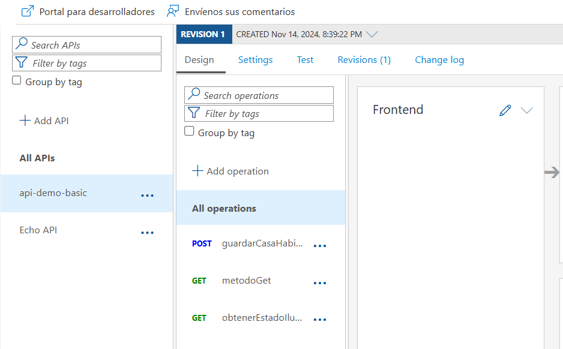

# Guía BD Azure, desplegar Docker local y Azure en Kubernetes

> Describe los pasos a realizar para desplegar nuestra aplicación en un docker local y luego como extraer la imagen para hacerlo en Azure Kubernetes con balanceador de carga y acceso por Api Management

**Importante**: El costo promedio de esta implementación es de alrededor de **20USD**

Abrir consola


Script para crear grupo de recursos
```
az group create --name rg_aks_bd --location eastus
```

1. **Crear BD Mysql**

    1. Teniendo la cuenta de Azure, elegir: Azure Database for MySQL
    2. Creación avanzada
    3. Elegir grupo de recursos y dar nombre al servidor
    4. Elegir las configuraciones minimas para la máquina
    5. Elegir Autenticación de Mysql
    6. En redes: Elegir acceso público y configurar el rango de IPs 0.0.0.0 hasta 255.255.255.255
    7. Cerrar y crear
    8. Cuando se cree, para conectarlo por dbeaver se debe cambiar en parámetros del servidor la opción require_secure_transport = OFF
    9. Conectar por dbeaver Ejemplo:  
        a. host: jdbc:mysql://server-testbd-mysql.mysql.database.azure.com:3306/dbdomotica  
        b. user: myuser  
        c. pass: mypass  

2. **Crear el .jar**
    1. Configurar en el pom nombre del jar

    ```xml
    <build>
    ...
    <finalName>demo-serviciorest</finalName>
    </build>
    ```
    2. Ejecutar el comando para crear el .jar, esto crear en la carpeta target de la aplicación el archivo .jar que hemos indicado en el "build" de pom.xml maven 
    ```
    mvn clean package
    ```

3. **Crear la imagen y el contenedor**
    1. Crear el dockerfile
    ```
    FROM openjdk:21-jdk
    ADD target/demo-serviciorest.jar app-demo-serviciorest.jar
    EXPOSE 8080
    ENTRYPOINT java -jar app-demo-serviciorest.jar
    ```
    2. Ubicarse en la carpeta de la aplicación y abrir la consola
    3. Ejecutar el comando que genera la imagen a partir del dockerfile e indicar un nombre para la imagen
    ```
    docker build -t imagenappdemorest .
    ```
    4. Ejecutar el comendo que crea el contenedor a partir de la imagen previamente generada e indicar por cual puerto queremos exponer la aplicación
    ```
    docker run --env-file .az-env.docker -p 9001:8080 imagenappdemorest
    ```
    5. probamos la aplicación en el servidor local, si aplica H2 se ejecutan scripts, de lo contrario ya al iniciar la bd deben estar ejecutados: Postman o Swagger
    ```
    http://localhost:9001/api/iluminacion/consultar
    http://localhost:9001/api/iluminacion/guardar
    http://localhost:9001/swagger-ui/index.html
    ```
    6. aprovisionamos la base de datos h2 con los scripts de base de datos para que la consulta descargue los datos.

4. **Subir imagen al portal de AZURE**
    1. Instalar CLi de Azure [Ver guía](https://learn.microsoft.com/es-es/cli/azure/install-azure-cli-windows?tabs=azure-cli)
    2. Abrir consola de comandos
    ```
    az login
    ```
    3. Crear el espacio en ACR (Azure Container Register): Ejemplo
    ```
    acrdomotica.azurecr.io
    ```
    Luego, conectamos con ACR creado en azure
    ```
    az acr login -n acrDomotica
    ``` 
    4. Ejecutar los comandos
    ``` 
    docker images
    docker tag imagenappdemorest:latest acrdomotica.azurecr.io/demoapprest/dev:latest
    docker push acrdomotica.azurecr.io/demoapprest/dev:latest
    ``` 
    5. Ahora que esta creada la imagen en el ACR de Azure procedemos a crear el ACI (Azure container instance) para desplegar nuestra imagen

# Servicios de contenedores AZURE: ACI

1. **Habilitar usuario administrador** Ir al recurso de ACI creado, luego en claves de acceso y habilitar el usuario administrador.
2. **Crear instancia de contenedor**  
- Indicar nombre: aci-domotica  
- Elegir azure container registry  
- En redes indicar puerto 8080: TCP e indicar el nombre DNS para no acceder necesariamente por la IP
- En avanzado configurar variables de entorno si aplica
- El contendedor debe estar en estado running
- Acceder por el navegador ejemplo: 
```
http://aci-domotica-test.cvadbkf2bkgtechf.eastus.azurecontainer.io:8080/api/iluminacion/consultar
```

# Servicios de Kubernetes AZURE

1. Ver la guía en la documentación de Azure: [Guía K8s azure](https://learn.microsoft.com/es-es/training/modules/aks-deploy-container-app/3-exercise-create-aks-cluster?tabs=linux)
2. Se usará la guía usando comandos
3. En azure abrir Cloud Shell y Crear variables
```
export RESOURCE_GROUP=rg_aks_centraldemo
export CLUSTER_NAME=aks-pragma-domotica
export LOCATION=centralus
```
4. Crear Cluster: Si se da el error: ErrCode_InsufficientVCPUQuota, visitar el siguiente [link](https://learn.microsoft.com/en-us/answers/questions/2088453/(errcode-insufficientvcpuquota)-insufficient-regio) para dar solución.
```
az aks create --resource-group $RESOURCE_GROUP --name $CLUSTER_NAME --node-count 2 --generate-ssh-keys --node-vm-size Standard_B2s --network-plugin azure
```
5. Crear grupo de nodos:  se debe crear con B2 para permitir crear grupos de nodos y balanceadores de carga
```
az aks nodepool add --resource-group $RESOURCE_GROUP --cluster-name $CLUSTER_NAME --name userpool --node-count 2 --node-vm-size Standard_B2s
```
6. Vincular el cluster con kubectl
```
az aks get-credentials --name $CLUSTER_NAME --resource-group $RESOURCE_GROUP
```
7. Validar si se ven los nodos: deben verse 4 nodos en 2 grupos diferentes
```
kubectl get nodes
```
8. Dar permisos a kubernetes al ACR
```
az aks update -n $CLUSTER_NAME -g $RESOURCE_GROUP --attach-acr [nombre acr]
```
9. Si genera error al ejecutar los comandos porque se cerró la sesión se debe ejecutar
```
az aks get-credentials --resource-group $RESOURCE_GROUP --name $CLUSTER_NAME
```
10. Crear archivo de manifiesto
```
touch deployment.yaml
```
11. En el shell colocar, para abrir el editor
```
code .
```
12. Colocar los datos para el manifiesto
```
# deployment.yaml
apiVersion: apps/v1
kind: Deployment
metadata:
  name: domotica-website
spec:
  replicas: 3
  selector:
    matchLabels:
      app: domotica-website
  template:
    metadata:
      labels:
        app: domotica-website
    spec:
      nodeSelector:
        kubernetes.io/os: linux
      containers:
        - image: acrdomotica.azurecr.io/demoapprest/dev:latest
          name: container-domotica-website
          resources:
            requests:
              cpu: 100m
              memory: 128Mi
            limits:
              cpu: 250m
              memory: 256Mi
          ports:
            - containerPort: 8080
              name: http
          env:
            - name: MY_SQL_URL
              value: "jdbc:mysql://server-testbd-mysql.mysql.database.azure.com:3306/dbdomotica"
            - name: MY_SQL_USER
              value: "adminazmysql"
            - name: MY_SQL_PASS
              value: "Test*321"

```
13. Ejecutar archivo
```
kubectl apply -f ./deployment.yaml
```
14. Validar despliegue
```
kubectl get deploy domotica-website
```
15. Validar estado del pod
```
kubectl get pods
```
16. Ver logs del pod
```
kubectl logs [nombre del POD]
```
17. Crear archivo de manifiesto para load balancer
```
touch service.yaml
```
18. En el shell colocar, para abrir el editor
```
code .
```
19. Escribimos en el archivo service.yaml
```
apiVersion: v1
kind: Service
metadata:
  name: domotica-website-service
spec:
  type: LoadBalancer
  selector:
    app: domotica-website
  ports:
  - protocol: TCP
    port: 80
    targetPort: 8080 # Puerto del deployment.yaml escucha
```
20. Ejecutar el manifiesto
```
kubectl apply -f ./service.yaml
```
21. ver la IP externa del balanceador de carga
```
kubectl get services
```
22. Reiniciar el despliegue si es necesario
```
kubectl rollout restart deployment domotica-website
```
23. Acceder a la aplicación por la IP externa, ejemplo:
```
http://48.214.169.61/api/iluminacion/consultar
```
24. Url Documentación swagger
```
http://48.214.169.61/swagger-ui/index.html#/
```
# Azure API Management al Load balancer

1. Crear API Management, indicar la información solicitada y elegir Developer, el costo mas bajo, según la calculadora de precios [Ver](https://azure.microsoft.com/es-es/pricing/calculator/) 24 horas es igual a 1.58 USD
2. La creación de este servicio tarda al rededor de 30 minutos
3. Abrir la ejecución de la aplicación en la especificación de Openapi
```
http://48.214.169.61/api-docs
```
4. Ingresar al recurso de API Management, menú lateral elegir API y seleccionar Create from OpenAPI specification



5. Validación de la aplicación por postman
```
http://api-manag-aks.azure-api.net/domotica/api/iluminacion/consultar
```
Directamente esto genera error: { "statusCode": 401, "message": "Access denied due to missing subscription key. Make sure to include subscription key when making requests to an API." }

6. Validar en los Setting del api en la parte inferior donde indica **Subscription**, validar el nombre del header indicado o crear uno nuevo y se debe agregar al header de la petición.


# Azure API Configuration

1. Creamos las variables de entorno en recursos de configuración para evitar quemarlos en el manisfiesto, definir las variables que requerimos
```
export RESOURCE_GROUP=rg_aks_centraldemo
export CONFIGURATION_NAME=appconfig-db-domotica
export LOCATION=centralus
```
2. Creamos el recurso de configuración
```
az appconfig create --name $CONFIGURATION_NAME --resource-group $RESOURCE_GROUP --location $LOCATION
```
3. Crear la clave con la información de la url
```
az appconfig kv set --name $CONFIGURATION_NAME --key MY_SQL_URL --value "jdbc:mysql://server-testbd-mysql.mysql.database.azure.com:3306/dbdomotica"
```
### Recursos adicionales
- [Crear imagen y subir a ACR](https://www.youtube.com/watch?v=Rh8u3kv4nOk)
- [Crear K8s en Azure](https://learn.microsoft.com/es-es/training/modules/aks-deploy-container-app/)
- [Tutorial crear api management](https://www.youtube.com/watch?v=Gu9reN09mXI)
- [Tipos de servicios en K8s](https://kubernetes.io/docs/concepts/services-networking/service/#publishing-services-service-types)
- [Documentación Azure kubernetes](https://learn.microsoft.com/es-es/azure/architecture/reference-architectures/containers/aks-start-here)
- [Documentación oficial Kubernetes](https://kubernetes.io/es/docs/home/)

[Volver al inicio](README-AZURE.md)

**Author**: Pedro Luis Osorio Pavas [Linkedin](www.linkedin.com/in/pedro-luis-osorio-pavas-68b3a7106)  
**Start Date**: 13-11-2024  
**Update Date**: 15-11-2024.