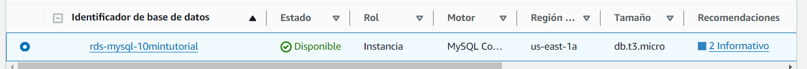
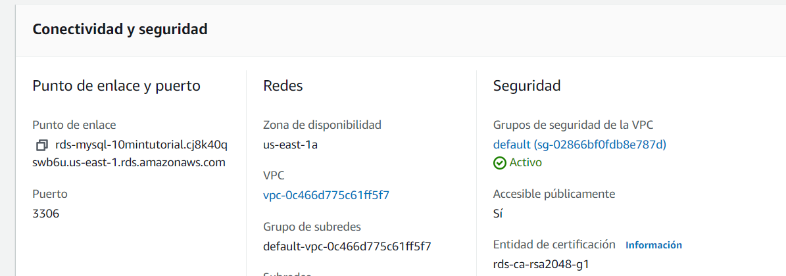
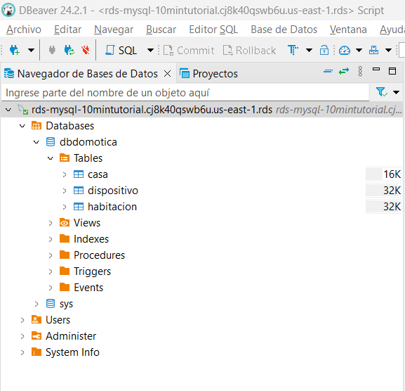
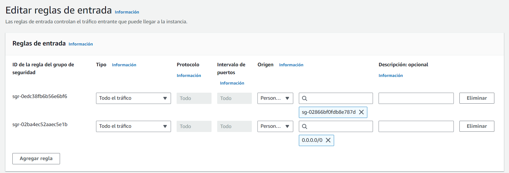
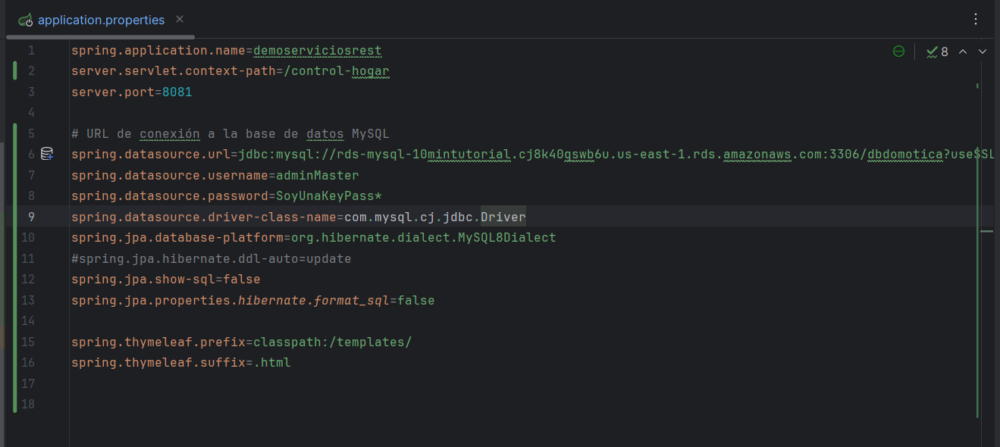
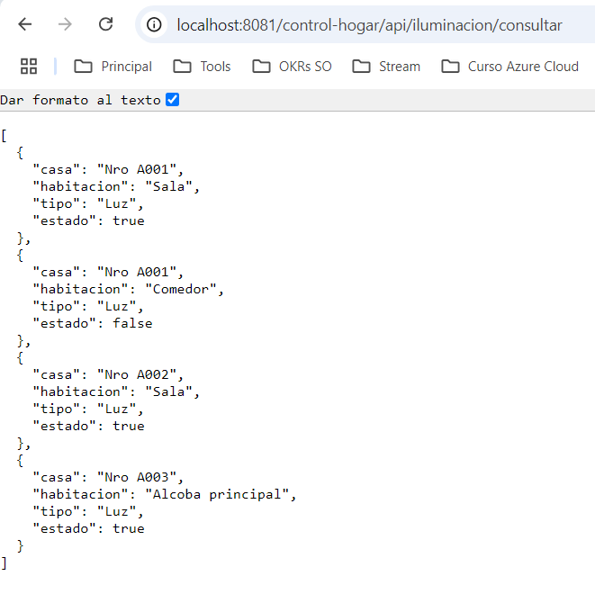
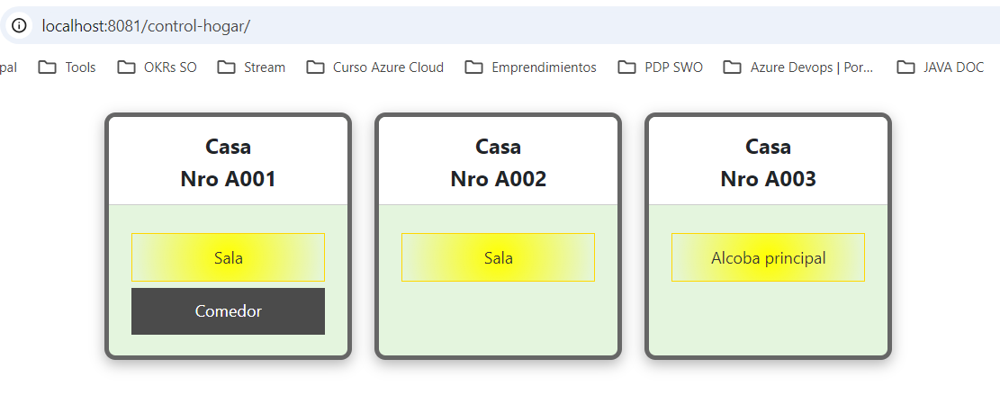

# Api Rest Básico

> Proyecto de API REST para un sistema de domótica, diseñado para extraer y gestionar información de un hogar, incluyendo sus habitaciones y dispositivos conectados. Los datos se exponen en formato JSON, facilitando la visualización del estado de los dispositivos. Además, el proyecto incluye una página web interactiva que muestra estos datos, renderizando el estado de las luces, indicando si están encendidas o apagadas según corresponda en cada habitación. Incluye una guía de como generar imagen docker y desplegarla en AWS Elastic Container Service.

## Características

1. **Cobertura de código**
   - 

2. **Análisis sonarlint**
   - 

3. **Análisis sonarlint: Resultado**
   - 

4. **End point**
   - 

5. **bd creada en AWS**
   - 
   - 
   - 

6. **Configuración bd pública**
   - 

6. **Conexión bd en archivo .properties**
la base de datos es temporal, esto es un ejemplo.
   - 

7. **Resultado lectura conexión bd (endpoind and frontend)**
   - 
   - 

8. **Recurso guía creación bd mysql**
 - [Url Guía crear bd en aws](https://aws.amazon.com/es/getting-started/hands-on/create-mysql-db/?ref=gsrchandson)

9. **Scripts bd**
 - ver: doc/scripts-bd.sql

10. Desplegar en docker local y ECS AWS
 - [Readme configuracion docker](README-DOCKER-AWS.md) 
---

**Author**: Pedro Luis Osorio Pavas [Linkedin](www.linkedin.com/in/pedro-luis-osorio-pavas-68b3a7106)
**Start Date**: 01-10-2024

