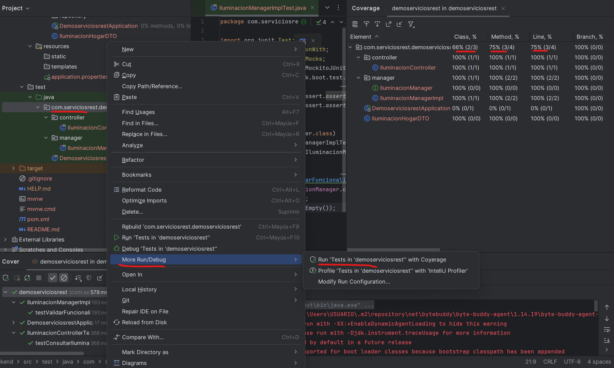
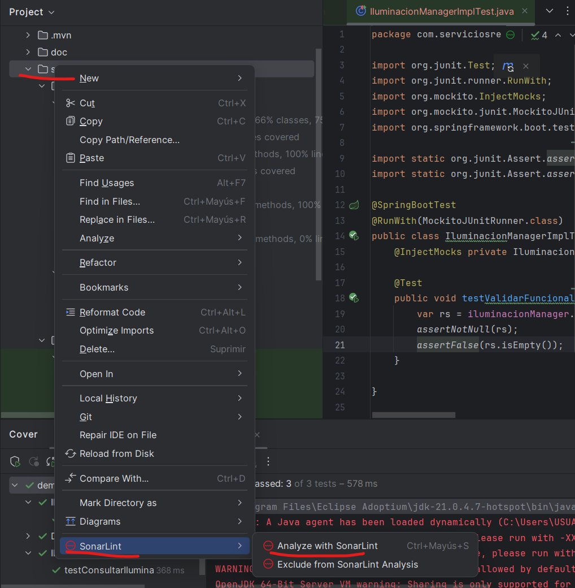
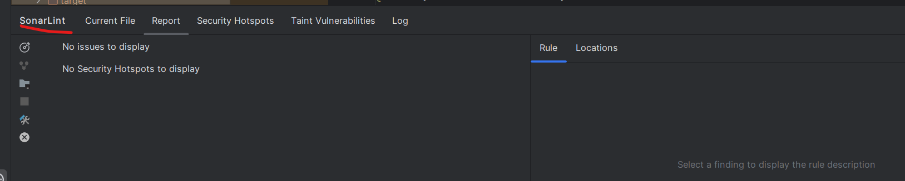
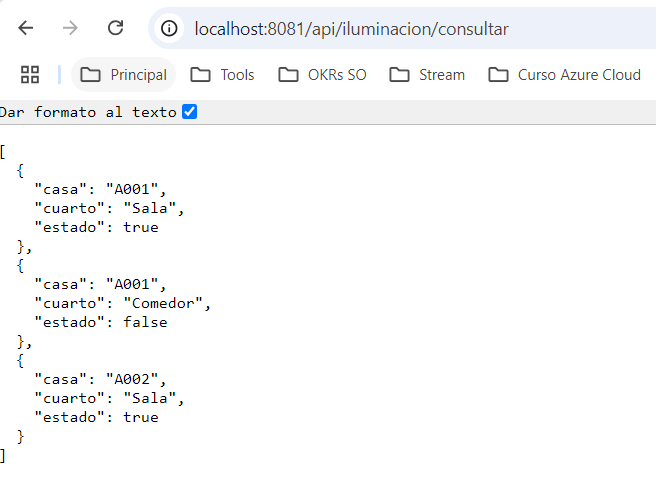

# Api Rest Básico

> Api Rest endpoint

## Características

1. **Cobertura de código**
   - 

2. **Análisis sonarlint**
   - 

3. **Análisis sonarlint: Resultado**
   - 

4. **End point**
   - 
---

**Author**: Pedro Luis Osorio Pavas [Linkedin](www.linkedin.com/in/pedro-luis-osorio-pavas-68b3a7106)
**Start Date**: 01-10-2024

