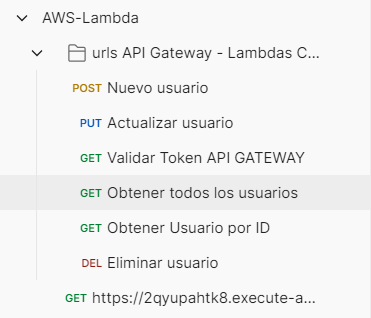
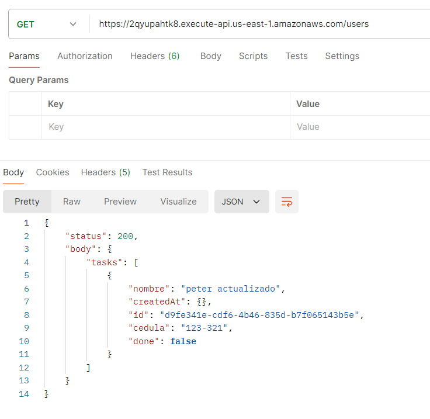
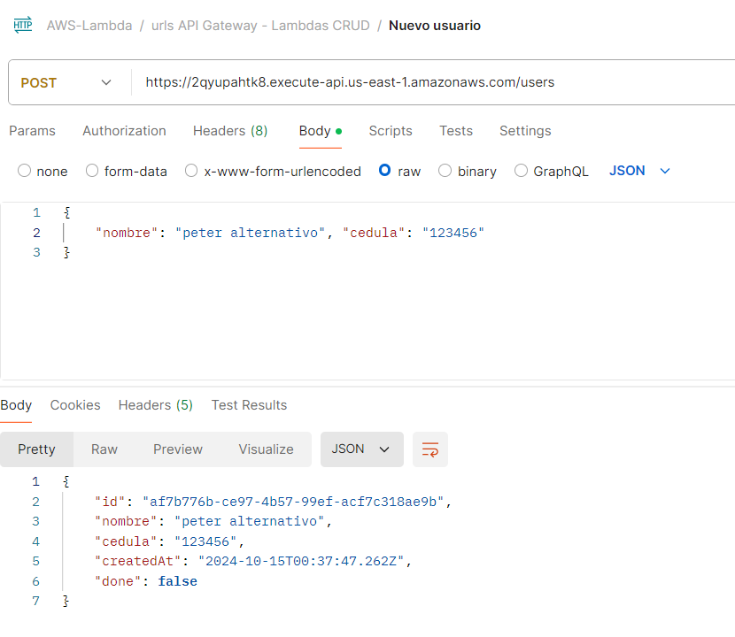
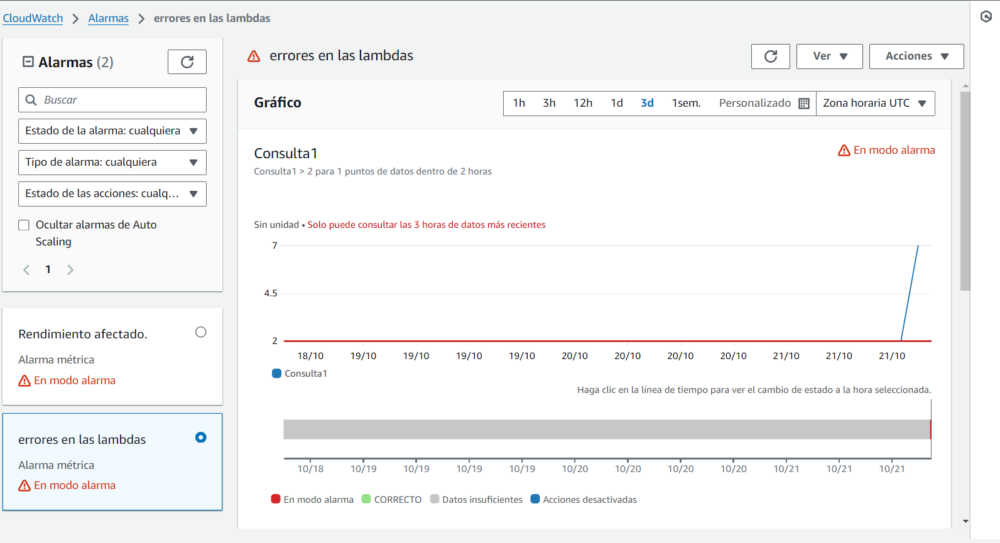
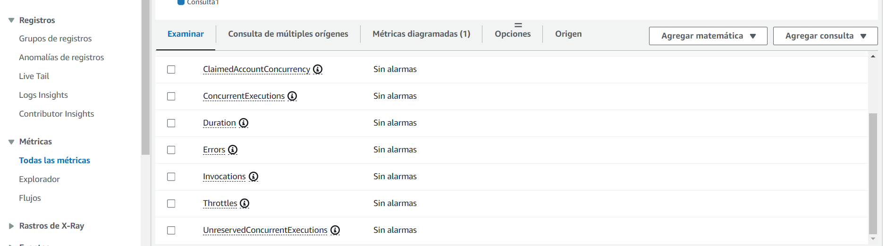
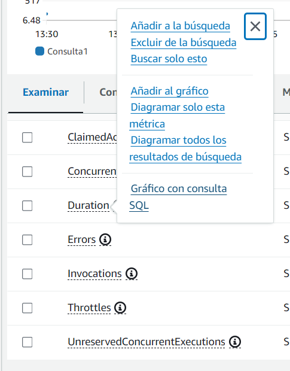
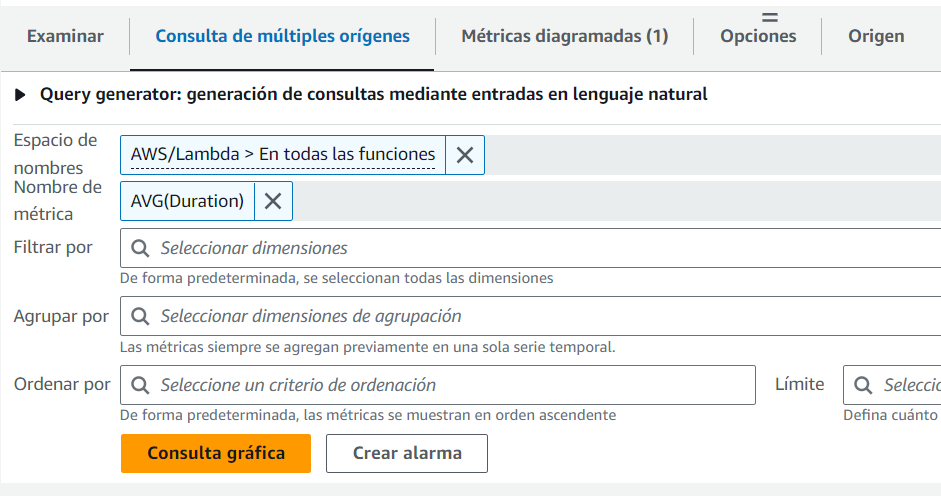

# Frontend Angular conexión Cognito AWS

> Proyecto en NodeJS que implementa funcionalidades CRUD a una bd DynamoDB

### El proyecto incluye:

- Operación GET, POST, PUT, DELETE, GET por ID

## Características

1. **Instalar el framework Serverless**
   ```
    npm i serverless -g
    ```
2. **Crear una carpeta en el espacio de trabajo del pc**
   Ejecutar para crear un proyecto: 
   ```
   serverless
   ```
   Elegir los pasos:
      1. HTTP API NODE
      2. login / register, se puede hacer login con la cuenta de github
      3. En crear o seleccionar aplicación existente indicar: Skip adding an app

3. **Configurar archivo .yml**
   En el archivo .yml agregar la region donde se va a desplegar la lambda en aws
   ```
   provider:
      name: aws
      runtime: nodejs20.x
      region: us-east-1
   ```

4. **Instalar dependencias**
   Generador del código primario del registro en la tabla
   ```
   npm i uuid
   ```
   Sdk de AWS para conectarse a Dynamodb
   ```
   npm i aws-sdk
   ```

5. **Ejecutar comando para desplegar las funciones**
   ```
   serverless deploy --verbose
   o
   sls deploy
   ```
   De acuerdo a las funciones y la configuración del archivo .yml, esto crea el apigateway, la función lamdba y la tabla en dynamoDB

   **Nota:** Se requiere haber realizado el AWS configure para enlazar la solución con AWS

6. **Resultado**
 - 
 - 
 - 

**Alarmas en CloudWatch**: Envía correo cuando se han superado los 2 errores 500, se creó en el metodo getUsers una funcionalidad que genera errores de forma aleatoria.

 - 
 - 
 - 
 - 

### Recursos adicionales
- [Serverless Framework](https://www.serverless.com/framework/docs/getting-started)
- [Serveless Resources](https://www.serverless.com/framework/docs/providers/aws/guide/resources)
- [Guía youtube](https://www.youtube.com/watch?v=wvux4WOU5dc&t=819s)
---

**Author**: Pedro Luis Osorio Pavas [Linkedin](www.linkedin.com/in/pedro-luis-osorio-pavas-68b3a7106)
**Start Date**: 14-10-2024

