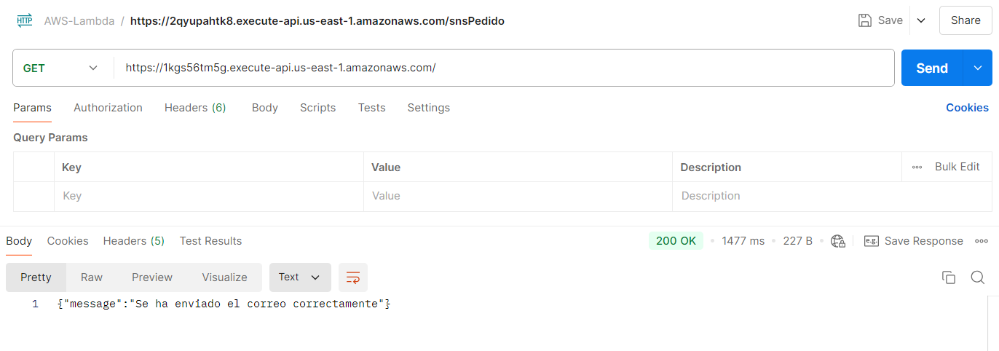
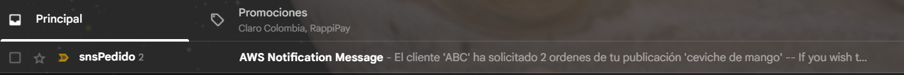
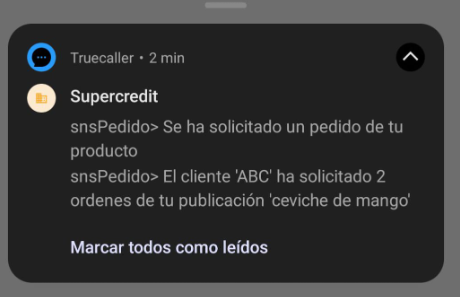

# Frontend Angular conexión Cognito AWS

> Proyecto en NodeJS que implementa envío de notificaciones SNS Email y SMS a Celular

### El proyecto incluye:

- Operación GET

## Características

1. **Instalar el framework Serverless**
   ```
    npm i serverless -g
    ```
2. **Crear una carpeta en el espacio de trabajo del pc**
   Ejecutar para crear un proyecto: 
   ```
   serverless
   ```
   Elegir los pasos:
      1. HTTP API NODE
      2. login / register, se puede hacer login con la cuenta de github
      3. En crear o seleccionar aplicación existente indicar: Skip adding an app

3. **Configurar archivo .yml**
   En el archivo .yml agregar la region donde se va a desplegar la lambda en aws
   ```
   provider:
      name: aws
      runtime: nodejs20.x
      region: us-east-1
   ```

4. **Instalar dependencias**
   Sdk de AWS para conectarse a Dynamodb
   ```
   npm i aws-sdk
   ```

5. **Guardar metricas estructuradas**
   ```
   npm install aws-embedded-metrics
   ```

6. **Ejecutar comando para desplegar las funciones**
   ```
   serverless deploy --verbose
   ```
   o
   ```
   sls deploy
   ```
   De acuerdo a las funciones y la configuración del archivo .yml, esto crea el apigateway y la función lamdba

   **Nota:** Se requiere haber realizado el AWS configure para enlazar la solución con AWS

7. **Se debe realizar la configuración del rol autorizando acceso al ARN del Topic creado**
   ```
   iamRoleStatements:
    - Effect: Allow
      Action:
        - sns:*
      Resource:
        - arn:aws:sns:us-east-1:284244831666:[Topic]
   ```

8. **Resultado**
 - 
 - 
 - 

### Recursos adicionales
- [Serverless Framework](https://www.serverless.com/framework/docs/getting-started)
- [Serveless Resources](https://www.serverless.com/framework/docs/providers/aws/guide/resources)
- [Guía youtube](https://www.youtube.com/watch?v=wvux4WOU5dc&t=819s)
---

**Author**: Pedro Luis Osorio Pavas [Linkedin](www.linkedin.com/in/pedro-luis-osorio-pavas-68b3a7106)
**Start Date**: 21-10-2024